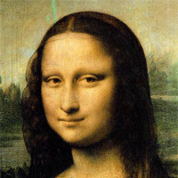

# evo-lisa

Experimenting [genetic programming][gp-mona-lisa] by using different programming languages.

## Implementations

- [Python](./python)

Original | Result
:-------------------------:|:-------------------------:
  |  
  |  

## Resources

- [Genetic Programming: Evolution of Mona Lisa][gp-mona-lisa]

[gp-mona-lisa]: https://rogerjohansson.blog/2008/12/07/genetic-programming-evolution-of-mona-lisa/
